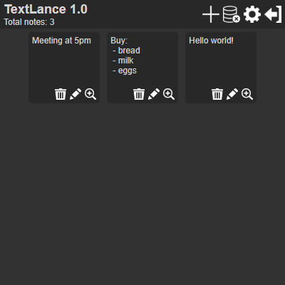

# What is Textlance?
Textlance is an extension for Google Chrome, Opera where you can create, edit, delete notes. The extension is still under development, please let me know if you find any bugs.

> [!CAUTION]
> The extension is still under development and may contain bugs.

# How do I install the extension?
You can download the extension in the release section.

1)Open Chrome or Opera: Ensure you have the Chrome or Opera browser open.

2)Go to Extensions Page:
- For Chrome: Enter chrome://extensions in the address bar.
- For Opera: Enter opera://extensions in the address bar.

3)Enable Developer Mode: On the Extensions page, toggle the switch for Developer mode in the top-right corner.

4)Unzip the Extension: If your extension is in a zipped archive, extract the contents to a folder on your computer.

5)Load Unpacked Extension:
- Click the Load unpacked button.
- Navigate to the directory where you extracted the extension.
- Select the folder and click Select Folder (or Open).
  
# What's in here?
When you first open the extension, on the top right you will see buttons for. 
Opposite the buttons, on the left, you'll see a note counter, as well as the name and current version of the extension

Still at the top you will see 5 buttons.

- Create: creates a new note
- Delete All: deletes all notes
- Settings: opens settings
- Donate: will open a page with the cryptocurrency wallet address for donations
- Exit: closes the extension

> [!TIP]
> If you don't understand what a particular button does, hover over it with the mouse and wait 1 second. A tooltip will appear next to the button.

# Creating a new note

When you click the create button, you will open the built-in editor where there is a line 
counter, character counter and two buttons to save, exit and input field. Just type the text 
in the input box and click save to save the note. If you want to exit without saving, press 
exit. *In this case the data will not be saved.

To close the editor without saving, click on the cross in the upper left corner.

# Editing an existing note

Each note has 3 buttons. 

- View
- Edit
- Delete

Click the pencil icon next to the note you want to edit. 
This will open the same text editor that you have already seen when creating a new note. Edit the note and click save.

To close the editor without saving, click on the cross in the upper left corner.

# Note view mode

Click the magnifying glass icon on the note you want to view. This will open a view where editing is not possible. All you can do is copy the whole note or just the highlighted one. 

To copy the whole note, click the copy all button on the top panel or in the context menu (see working with the context menu). To copy a selected area, select what you are interested in and click the copy selected button on the top panel or in the context menu. You can also use Ctrl + C

To close the view of the note, click on the cross in the upper left corner.

# Working with the context menu

The context menu of the view and edit modes have different functionality.

## Context menu in editor

In edit mode, you can open the context menu by right-clicking anywhere in the input field. It has several functions:

- Copy
- Paste
- Cut
- Select All

To select a function, simply click on it in the context menu. Click anywhere to close the context menu.

## Context menu in viewer

Unlike the editor, the context menu has only 2 functions. In fact, it duplicates the top panel. 

- Copy all. Just open the context menu by clicking on the input field and click copy all. This will copy the text of the entire note to the clipboard

- Copy selected text. Select the text, open the context menu and click copy selected text. After that the highlighted area will be copied to the clipboard.

# Settings

There are 2 parameters in the settings. The first one sets the size of the text in the editor. Write there any value in pixels. The second parameter is responsible for word transposition in the editor. To reset the settings, press the reset settings button.

# Support my project

This extension is free, please give it a star. Thank you!
